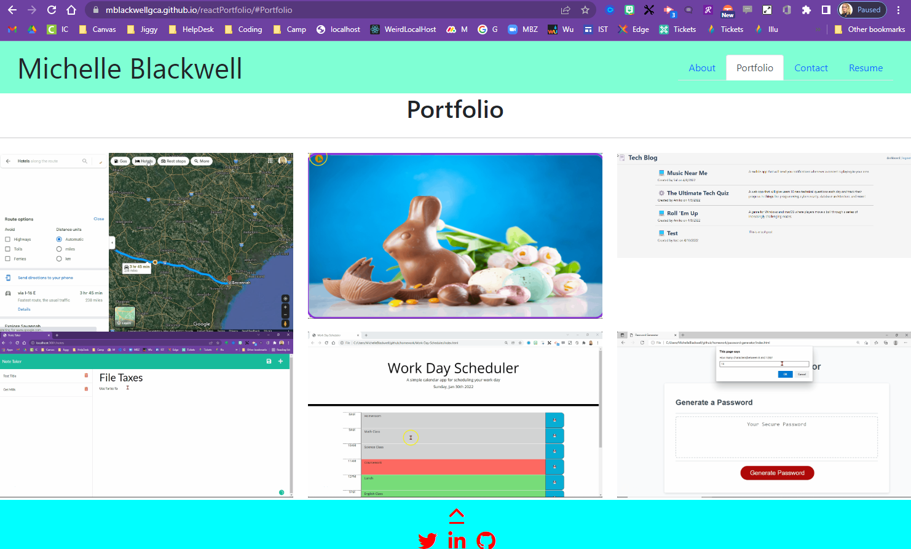
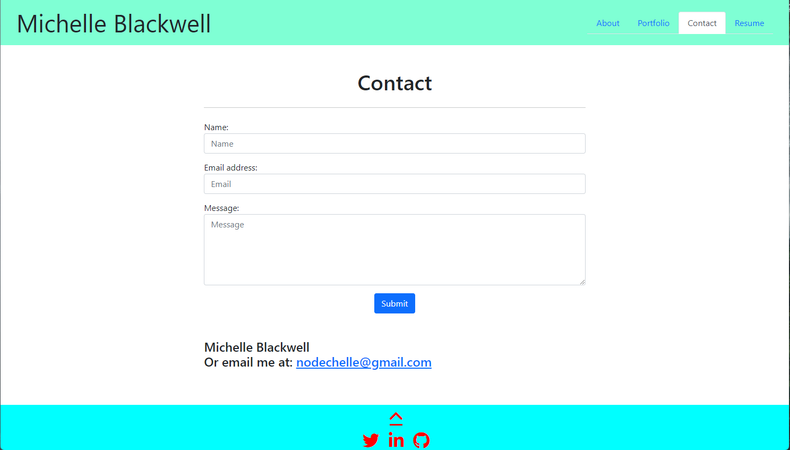
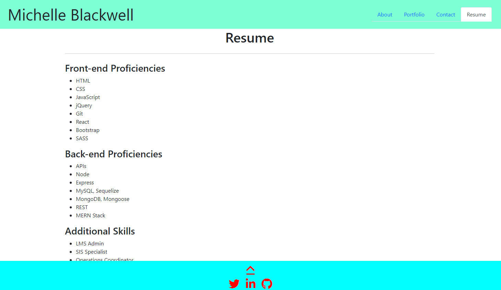

## React Portfolio Template
A developers portfolio template created using React

## Live Links

- 📽️ Deployed app: https://mblackwellgca.github.io/reactPortfolio/
- 🌍 Repository: https://github.com/mblackwellgca/reactPortfolio

## Description

- AS AN employer looking for candidates with experience building single-page applications
    - I WANT to view a potential employee's deployed React portfolio of work samples
    - SO THAT I can assess whether they're a good candidate for an open position

## Installation

    - This project was bootstrapped with [Create React App](https://github.com/facebook/create-react-app).
    - In the project directory, you can run: `npm start` Runs the app in the development mode.\
    - Open [http://localhost:3000](http://localhost:3000) to view it in your browser. The page will reload when you make changes.\
    - `npm run build` Builds the app for production to the `build` folder.\
    - It correctly bundles React in production mode and optimizes the build for the best performance.

## Criteria

 GIVEN a single-page application portfolio for a web developer
* WHEN I load the portfolio
    * THEN I am presented with a page containing a header, a section for content, and a footer
* WHEN I view the header
    * THEN I am presented with the developer's name and navigation with titles corresponding to different sections of the portfolio
* WHEN I view the navigation titles
    * THEN I am presented with the titles About Me, Portfolio, Contact, and Resume, and the title corresponding to the current section is highlighted
* WHEN I click on a navigation title
    * THEN I am presented with the corresponding section below the navigation without the page reloading and that title is highlighted
* WHEN I load the portfolio the first time
    * THEN the About Me title and section are selected by default
* WHEN I am presented with the About Me section
    * THEN I see a recent photo or avatar of the developer and a short bio about them
* WHEN I am presented with the Portfolio section
    * THEN I see titled images of six of the developer’s applications with links to both the deployed applications and the corresponding GitHub repositories
* WHEN I am presented with the Contact section
    * THEN I see a contact form with fields for a name, an email address, and a message
* WHEN I move my cursor out of one of the form fields without entering text
    * THEN I receive a notification that this field is required
* WHEN I enter text into the email address field
    * THEN I receive a notification if I have entered an invalid email address
* WHEN I am presented with the Resume section
    * THEN I see a link to a downloadable resume and a list of the developer’s proficiencies
* WHEN I view the footer
    * THEN I am presented with text or icon links to the developer’s GitHub and LinkedIn profiles, and their profile on a third platform (Stack Overflow, Twitter)

## Usage

The following animation demonstrates the application functionality:

## Credits

- 💻 Christopher Ponzio https://github.com/ChristopherPonzio
- 🏫 Sandra Smith
- 🔗 https://www.w3schools.com/
- 🔗 https://stackoverflow.com/
- 🔗 https://chooselicense.com/
- 🔗 https://img.shields.io/
- 🤔 You can learn more in the [Create React App documentation](https://facebook.github.io/create-react-app/docs/getting-started).
- 🤔 To learn React, check out the [React documentation](https://reactjs.org/).

## License

## MIT License